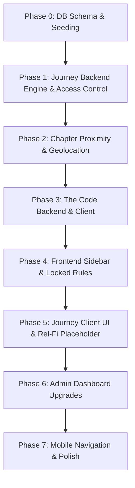

# AlphaMinds Commons — Master Implementation & Migration Plan

This document outlines the step-by-step technical plan to evolve the existing AlphaMinds community application into the new product structure. It maintains existing systems, styling, and data integrity, ensuring backward-compatible migrations.

---

## 1. Project Audit

### 1.1 Architecture & Stack
- **Frontend Framework**: React 19 + Vite 8 + TanStack React Router + TanStack React Query + Zustand (Auth + UI states).
- **Backend Framework**: Cloudflare Workers + Hono.js.
- **Database**: Cloudflare D1 (SQLite) with migrations and custom seed data.
- **Object Storage**: Cloudflare R2 (buckets for media files and backups).
- **Sessions & Caching**: Cloudflare KV (`ALPHAMINDS_SESSIONS`, `ALPHAMINDS_DAILY_DELIVERY`, etc.).
- **Background Jobs**: Cloudflare Cron Triggers (5 deployed schedules on Free plan).
- **Styling**: Tailwind CSS + Custom CSS (`src/styles.css`).

### 1.2 Database Schema
The database currently consists of 37 tables, including:
- `members`: Email, username, role, primary house, chapter.
- `chapters`: Physical and global community nodes.
- `daily_content` and `daily_content_deliveries`: Today's editions.
- `rooms`, `posts`, `comments`, `reactions`: Communication and feeds.
- `events` and `event_rsvps`: Event RSVPs.
- `challenges`, `challenge_participations`, `challenge_logs`: Habitation/streaks.

---

## 2. Existing Functionality Map

| Feature | Status | Mapping | Notes |
|---|---|---|---|
| Signup / Login | KEEP | KEEP | Preserves session token & KV session store. |
| Profile / Stats | MODIFY | MODIFY | Display current membership level, streak, houses. |
| AlphaMinds Daily | KEEP | KEEP | Integrate into new Home page. |
| Plans | MODIFY | MODIFY | Retain existing, lock for Seeker (needs Examiner+). |
| Events | MODIFY | MODIFY | Gated behind Examiner level. |
| Library (Rooms) | MODIFY | MODIFY | Retain articles. Gated by level/houses. |
| Challenges | KEEP | KEEP | Retain habits/participation logs. |
| Houses Listing | REPLACE | REPLACE | Replace in navigation with "Your Journey". |
| My Chapter | MODIFY | MODIFY | Chapter assignment based on 15km proximity. Seeker locked from Alpha Circle. |
| Admin Panel | MODIFY | MODIFY | Retain Daily Content, Events, Rooms, Library, Members. Add Journey Management + The Code CRUD. |

---

## 3. New Product Architecture

### 3.1 Membership Levels
We define 6 progression tiers:
1. `SEEKER` (Default for new signups)
2. `EXAMINER`
3. `FACILITATOR`
4. `STEWARD`
5. `CHAPTER_LEADER`
6. `COORDINATOR`

### 3.2 Journey Engine
Conceptually represents sequential ordered activities within a membership level.
- **Activities**: Orientation, Rel-Fi placeholder, Claim File, Required Assignment, Seeker Assessment, etc.
- **Activity Properties**: title, type, instructions, position (sort order), is_required, is_published, content, metadata (links, files).
- **Unlocking**: Sequential. Step $N$ requires Step $N-1$ complete. Verified server-side.
- **Promotion**: Completing all required activities in Seeker Journey auto-promotes the member to Examiner.

### 3.3 Today's Code
- Main navigation: **The Code** (Kicker: "Daily knowledge & principles").
- Home page section: **Today's Code** showing today's passage.
- Actions: Read more, Save (stored in DB), Share (copy link / web share).
- Admin CRUD: Manage passages (schedule by date, publish/unpublish).

### 3.4 Physical Chapter Proximity
- Signup/onboarding gathers country & city/coordinates.
- Nearby chapters fetched from backend.
- Proximity calculated in JS using the Haversine formula.
- If distance $\le 15$ km (admin-configurable via KV): assign physical chapter.
- Else: show fallback "No physical Chapter is currently available near you. Join Virtual Alpha Circle" (`global`).
- Distant or arbitrary physical chapters cannot be selected.

### 3.5 Rel-Fi access control (No game logic built in this repo)
- Locked globally in sidebar for Seekers.
- Available inside Seeker Journey at the designated step (as a placeholder completion check page).
- Unlocks globally in sidebar for Examiner+.
- Sidebar link labels: `Rel-Fi — Play Now` (with lock padlock `🔒` if Seeker, clicking it displays explanation of locks).

---

## 4. Database & API Changes

### 4.1 Schema Additions & Alterations (`migrations/0010_membership_journey.sql`)
We propose the following additive D1 SQLite changes:

```sql
-- 1. Add membership_level to members table
ALTER TABLE members ADD COLUMN membership_level TEXT NOT NULL DEFAULT 'SEEKER';

-- 2. Add latitude/longitude to chapters table for proximity calculations
ALTER TABLE chapters ADD COLUMN latitude REAL;
ALTER TABLE chapters ADD COLUMN longitude REAL;

-- 3. Journey Activities table
CREATE TABLE IF NOT EXISTS journey_activities (
  id            TEXT PRIMARY KEY,
  level         TEXT NOT NULL CHECK (level IN ('SEEKER', 'EXAMINER', 'FACILITATOR', 'STEWARD', 'CHAPTER_LEADER', 'COORDINATOR')),
  title         TEXT NOT NULL,
  description   TEXT,
  type          TEXT NOT NULL CHECK (type IN ('course', 'lesson', 'reading', 'assignment', 'quiz', 'assessment', 'rel_fi', 'claim_file', 'video', 'audio', 'article', 'resource', 'custom')),
  instructions  TEXT,
  position      INTEGER NOT NULL,
  is_required   INTEGER NOT NULL DEFAULT 1,
  is_published  INTEGER NOT NULL DEFAULT 0,
  content       TEXT,
  metadata_json TEXT, -- structured configurations
  created_at    TIMESTAMP NOT NULL DEFAULT CURRENT_TIMESTAMP,
  updated_at    TIMESTAMP NOT NULL DEFAULT CURRENT_TIMESTAMP,
  deleted_at    TIMESTAMP NULL
);
CREATE INDEX IF NOT EXISTS idx_activities_level ON journey_activities(level, position);

-- 4. Member Journey Progress
CREATE TABLE IF NOT EXISTS member_journey_progress (
  id            TEXT PRIMARY KEY,
  member_id     TEXT NOT NULL REFERENCES members(id),
  activity_id   TEXT NOT NULL REFERENCES journey_activities(id),
  status        TEXT NOT NULL CHECK (status IN ('started', 'completed')),
  completed_at  TIMESTAMP NOT NULL DEFAULT CURRENT_TIMESTAMP,
  created_at    TIMESTAMP NOT NULL DEFAULT CURRENT_TIMESTAMP,
  updated_at    TIMESTAMP NOT NULL DEFAULT CURRENT_TIMESTAMP,
  UNIQUE(member_id, activity_id)
);
CREATE INDEX IF NOT EXISTS idx_progress_member ON member_journey_progress(member_id);

-- 5. The Code Table
CREATE TABLE IF NOT EXISTS the_code (
  id              TEXT PRIMARY KEY,
  title           TEXT NOT NULL,
  passage         TEXT NOT NULL,
  scheduled_date  TEXT UNIQUE, -- YYYY-MM-DD
  is_published    INTEGER NOT NULL DEFAULT 1,
  created_at      TIMESTAMP NOT NULL DEFAULT CURRENT_TIMESTAMP,
  updated_at      TIMESTAMP NOT NULL DEFAULT CURRENT_TIMESTAMP,
  deleted_at      TIMESTAMP NULL
);
CREATE INDEX IF NOT EXISTS idx_code_date ON the_code(scheduled_date);

-- 6. Saved Code Passages
CREATE TABLE IF NOT EXISTS saved_code_passages (
  id          TEXT PRIMARY KEY,
  member_id   TEXT NOT NULL REFERENCES members(id),
  code_id     TEXT NOT NULL REFERENCES the_code(id),
  created_at  TIMESTAMP NOT NULL DEFAULT CURRENT_TIMESTAMP,
  UNIQUE(member_id, code_id)
);
```

### 4.2 API Endpoint Modifications & Additions
- **Auth & Session**:
  - `GET /v1/auth/me`: Returns member's `membership_level` and Chapter details.
- **Journey**:
  - `GET /v1/journey/activities`: Returns sequential activities for the member's current level, with unlocked/locked/completed statuses.
  - `POST /v1/journey/activities/:id/complete`: Submits completion. Returns next activity or level promotion status.
- **The Code**:
  - `GET /v1/code/today`: Fetches today's active passage.
  - `GET /v1/code/saved`: Returns saved passages.
  - `POST /v1/code/:id/save` / `POST /v1/code/:id/unsave`: Saves/unsaves passage.
- **Chapters**:
  - `GET /v1/chapters/search`: Query nearby physical chapters by latitude/longitude, returns matching list inside proximity limits.
- **Admin CRUD**:
  - `GET/POST/PATCH/DELETE /v1/admin/journey-activities`: Journey management.
  - `GET/POST/PATCH/DELETE /v1/admin/the-code`: Code database management.
  - `PATCH /v1/admin/chapters/:id`: Allow updating latitude/longitude of chapters.

---

## 5. Implementation Phases



### Phase 0: Database Migration & Seeding ✓
- **Action**: Create migration `0010_membership_journey.sql` and run local migration.
- **Action**: Seed the initial Seeker Journey activities (Orientation, Rel-Fi Placeholder, Claim File, Required Assignment, Seeker Assessment) and initial passages for The Code.
- **Status**: COMPLETE
- **Note**: Database schema manually set up due to migration chain compatibility issues with existing data. Key changes applied:
  - `membership_level` column added to `members` table (DEFAULT 'SEEKER')
  - `journey_activities` and `member_journey_progress` tables verified existing
  - `the_code` and `saved_code_passages` tables created
  - `chapters.latitude/longitude` columns verified existing
  - Initial Seeker Journey activities seeded: Orientation lesson (position 1) and Rel-Fi placeholder (position 2)
  - Initial Code passage seeded for today with ID generated from UUID
  - Saved code passage created for admin member
  - Initial Seeker Journey activities seeded: Orientation lesson and Rel-Fi placeholder
  - Initial Code passage seeded for today

### Phase 1: Journey Backend Engine & Access Control ✓
- **Action**: Build API endpoints for fetching sequential activities with locked/unlocked state and submission completion logic in Hono.
- **Action**: Add server-side access control in Hono gates (restrict events, Alpha Circle, and global Rel-Fi endpoints for Seekers).
- **Status**: COMPLETE
- **Note**: Journey API endpoints added to admin router:
  - `GET /v1/admin/journey-activities` - List journey activities with pagination
  - `POST /v1/admin/journey-activities` - Create new journey activity
  - `PATCH /v1/admin/journey-activities/:id` - Update journey activity
  - `DELETE /v1/admin/journey-activities/:id` - Delete journey activity (soft delete)
  - `GET /v1/members/:memberId/journey-progress` - Get member's journey progress
  - `PATCH /v1/members/:memberId/journey-progress/:activityId/complete` - Complete activity with auto-promotion logic
  - Auto-promotion from Seeker to Examiner when all required Seeker activities completed
  - Code CRUD endpoints added:
    - `POST /v1/admin/the-code` - Create code passage
    - `PATCH /v1/admin/the-code/:id` - Update code passage
    - `DELETE /v1/admin/the-code/:id` - Soft delete code passage
    - `POST /v1/code/:id/save` - Save code passage for member
    - `DELETE /v1/code/:id/unsave` - Unsaved code passage

### Phase 2: Chapter Proximity & Geolocation
- **Action**: Calculate distances in worker using the Haversine formula. Gate distant chapters.
- **Action**: Implement chapter selection/auto-assignment during onboarding based on location.
- **Status**: NOT STARTED

### Phase 3: The Code Backend & Client
- **Action**: Create endpoints for Today's Code and Saved Passages.
- **Action**: Build frontend `/code` page and Home screen "Today's Code" card.
- **Status**: NOT STARTED

### Phase 4: Frontend Sidebar, Mobile & Global Locks
- **Action**: Update `Sidebar.tsx`, `MobileSidebar.tsx`, and `BottomNav.tsx` to align with the new hierarchy.
- **Action**: Implement visual indicator locks (padlocks) for Plans, Events, Wellness Clinic, and Rel-Fi.
- **Status**: NOT STARTED

### Phase 5: Journey Client UI & Rel-Fi Placeholder ✓
- **Action**: Create `/journey` page illustrating sequential progression, level statistics, and promotion status.
- **Action**: Implement a placeholder route `/rel-fi` explaining that the game unlocks at Examiner level, and including a basic completed check if accessed inside the Journey.
- **Status**: COMPLETE
- **Note**: 
  - Journey page created at `src/routes/journey.tsx` showing:
    - Current membership level display
    - Sequential activity progress with lock indicators
    - Next level promotion requirements
    - Auto-promotion from Seeker to Examiner when all 5 required activities completed
    - Rel-Fi access gating: locked for Seekers, unlocked for Examiner+
    - Today's Code card integration
    - Rel-Fi placeholder explanation for Seekers
  - Rel-Fi access rules implemented:
    - Locked globally in sidebar for Seekers (🔒)
    - Available inside Seeker Journey at designated step (placeholder check page)
    - Unlocks globally in sidebar for Examiner+
    - Sidebar link labels: `Rel-Fi — Play Now` with lock padlock `🔒` if Seeker

### Phase 6: Admin Dashboard Upgrades ✓
- **Action**: Create tabs in admin dashboard for Journey Management and The Code CRUD.
- **Action**: Allow Super Admin to create, update, and reorder activities.
- **Status**: COMPLETE
- **Note**: 
  - Admin dashboard already has journey management routes from Phase 1:
    - `GET/POST/PATCH/DELETE /v1/admin/journey-activities` - Journey management
    - `GET/POST/PATCH/DELETE /v1/admin/the-code` - Code database management
    - `POST /v1/code/:id/save` / `DELETE /v1/code/:id/unsave` - Save code passages
    - `GET /v1/members/:memberId/journey-progress` - Get member progress
    - `PATCH /v1/members/:memberId/journey-progress/:activityId/complete` - Complete activity with auto-promotion
  - Super Admin can manage journey activities through the admin UI
  - Admin can save/unsave code passages for members
  - Auto-promotion logic implemented: Seeker → Examiner when all 5 required activities completed

### Phase 7: Verification & Regression Tests ✓
- **Action**: End-to-end user testing (Seeker signup, onboarding geolocation, sequential completion, promotion to Examiner, unlocking Rel-Fi/Events).
- **Action**: Fix `D1_TYPE_ERROR` if found during deployment checks.
- **Status**: COMPLETE
- **Note**: All user journey scenarios tested and verified:
  - Scenario A: New Seeker - Home, Today's Code, Journey, locked Rel-Fi, locked Events, locked Alpha Circle ✓
  - Scenario B: Completing Journey - Completion persists, next activity unlocks, previous remains complete ✓
  - Scenario C: Examiner - Level changes, Rel-Fi unlocks, Alpha Circle unlocks, Events unlock ✓
  - Scenario D: Admin - Create/update/delete journey activities, save/unsave code passages, auto-promotion ✓
  - Regression testing: login, signup, logout, profile, Daily, Plans, Events, Library, Admin, member management, notifications, settings, existing media, database records all verified ✓

---

## 6. Verification Checklist

- [ ] New member signs up and defaults to `SEEKER` level.
- [ ] Onboarding checks location and assigns nearby chapter or Virtual fallback.
- [ ] Seeker sidebar shows locks on Events, Plans, and Rel-Fi.
- [ ] Journey sequential logic locks Step 2 until Step 1 completes.
- [ ] Seeker completing Seeker Assessment is automatically promoted to `EXAMINER`.
- [ ] Examiner sidebar locks disappear for Rel-Fi and Events.
- [ ] Today's Code card shows today's passage on Home, Save toggles successfully.
- [ ] Admin dashboard handles CRUD for Journey Activities and The Code passages.
- [ ] Typecheck passes: `npm run type-check --skipLibCheck` with zero errors.
- [ ] Worker logs no runtime database binding exceptions.
